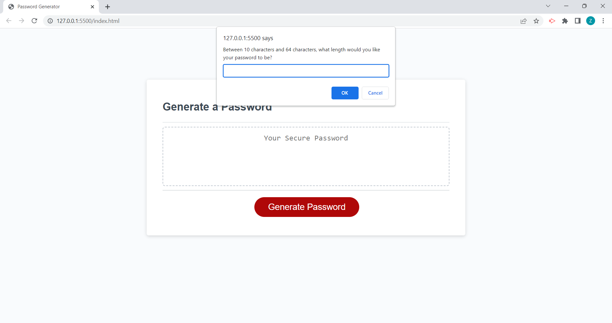
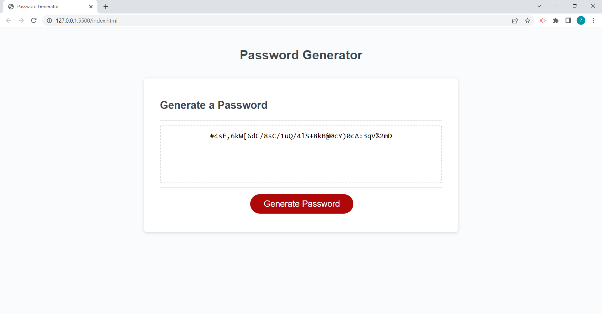

# Password-Generator
This application allows the user to generate a random password based on criteria they’ve selected.

## Description

This application allows the user to generate a random password based on criteria they’ve selected. This would be used when someone wants to create a strong password for an account on a website that would be hard to guess and would keep their account safe. This was created using JavaScript, HTML and CSS.

## Installation

N/A

## Usage

To use this Password Generator, you would use this link: https://zubeidadhupli.github.io/Password-Generator/ . A prompt should pop up and the user will be asked a series of questions about what characters they would like to incorporate into their password. Here is a screenshot of one of the password options prompt:  . Here is a screenshot of a password being created: .

## Credits

A collaborator that helped me with working out the password options and generating the password with user input: Alexandra Batrak. Their GitHub profile is https://github.com/alexandrabatrak .

## License

MIT License.